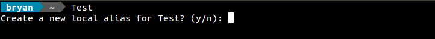
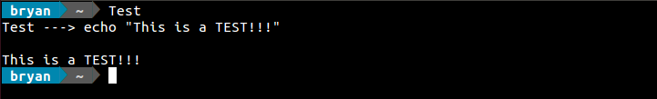

# LocalAlias Bash Script
This script works in parallel with the following lines that I have added to my `~/.bashrc` file:

``` bash
source localAlias

eval "$(echo "orig_command_not_found()"; declare -f command_not_found_handle | tail -n +2)"

command_not_found_handle() {
    GREP=$(grep -s "^$1$SEP" "./.localaliases")
    if LocalAlias $1 "$GREP" "${@:2}"; then
        echo
        orig_command_not_found "$1"
    fi
}
```

Essentially, what it does is provide me with the ability to setup aliases that are only active when run from the directory they were created in.

### Screenshot Walk-Through

Normally, when we enter an invalid command in a bash terminal, we are greeted with an error message and a suggestion for what commands we could have meant instead. The snippet above (placed in my `~/.bashrc` file) reroutes this "invalid" command to the `LocalAlias` function instead. Here's how creating a local-alias looks:




This alias will then be stored in the current directory (the `/home/bryan/` directory in this case) in a hidden file named `.localaliases`. If we were to look inside the `.localaliases` file, this is what we would find:
```
Test='echo "This is a TEST!!!"'
```

If I now run the `Test` command, it is redirected to the `LocalAlias` function once again. This time, however, the function reads the newly created entry in the `.localaliases` file and runs the command that is associated with `Test`, like so:



If we were to press `n` instead of `y` when prompted to create a local-alias, the "invalid" command would be redirected to the appropriate bash function and we would get the normal error message that we are accustomed to. This scenario is shown below.


